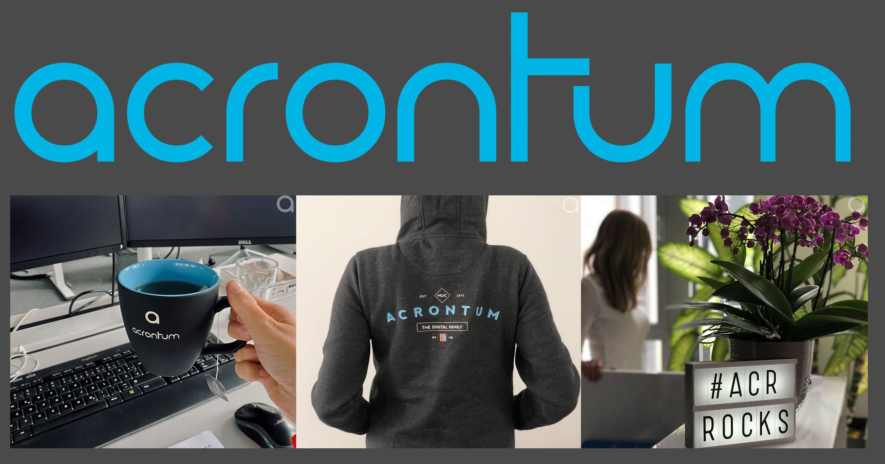

# Hey, we're Acrontum

We're just an international bunch of people who love what we do, and where we do it.

## Say hi

  

  

  

  

---

## Help us build cool stuff

### moxy

Simple, configurable, mock / proxy.

### boats-cli

Unofficial CLI for https://github.com/johndcarmichael/boats.

### oas-codegen

OpenAPI codegen tooling for documentation-driven-development.

### eslint-config

Strict typescript + prettier + eslint.

---

Also check out our partner projects:

### generate-it

OpenAPI codegen tooling for documentation-driven-development.

 

### boats

An OpenAPI & AsyncAPI templating system with Nunjucks.

